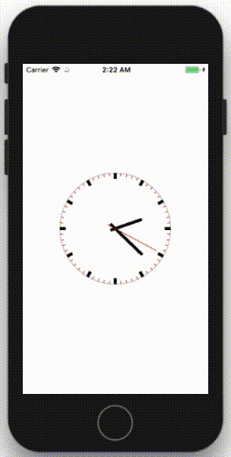

# Analog Clock UI Component
UI component that indicates the time as an analog clock.



### Usage

Just use like any regular view in storyboard.

You can start clock from any time.
```Swift
@IBOutlet weak var clockView: ClockView!

override func viewDidLoad() {
    super.viewDidLoad()
    clockView.start(time: Date(timeIntervalSinceNow: -60 * 60)) // 1 hour before
}
```

### Configure

You can configure component from storyboard or programmatically.
```Swift
clockView.autostart = true
clockView.showMarkers = true
clockView.showSecondHand = true

clockView.faceColor = .white
clockView.borderColor = .lightGray
clockView.fiveMarkerColor = .black
clockView.oneMarkerColor = .red
clockView.hourHandColor = .black
clockView.minuteHandColor = .black
clockView.secondHandColor = .red

clockView.borderThickness = 1
clockView.fiveMarkerHeight = 10
clockView.oneMarkerHeight = 5
clockView.fiveMarkerThickness = 5
clockView.oneMarkerThickness = 1
clockView.hourHandThickness = 5
clockView.minuteHandThickness = 5
clockView.secondHandThickness = 1
```
